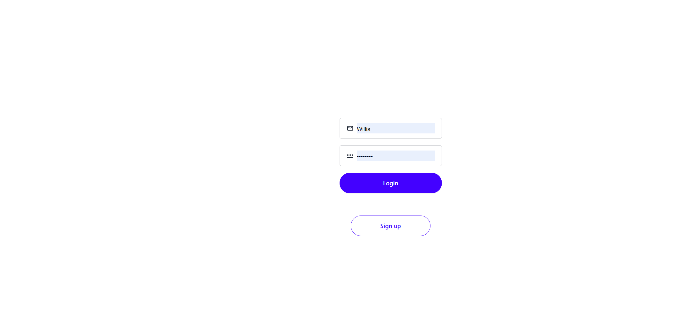
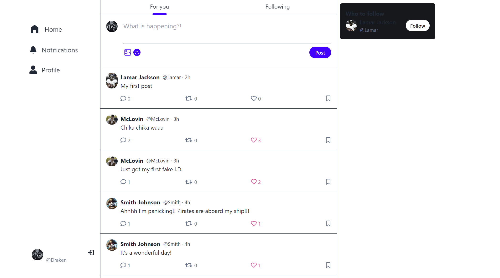
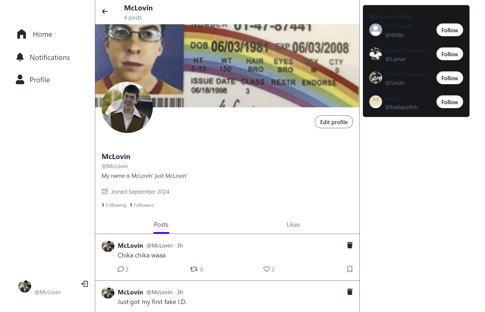

# XYZ

### Built With

<!-- Description -->
## Description
We have created a social media application called XYZ which is designed to help users connect, share, and discover content in real-time. Inspired by the functionality and spirit of Twitter, XYZ offers a seamless experience for engaging with the latest trends, conversations, and updates from around the globe.

<!-- Table of Contents -->
## Table of Contents
  - [Installation](#installation)
  - [Usage](#usage)
  - [Future Development](#future-development)
  - [License](#license)
  - [Tests](#tests)
  - [Contributing](#contributing)
  - [Contact](#contact)
  - [Acknowledgements](#acknowledgments)
  
<!-- Installation-->
## Installation 

1. Clone the rep `git clone git@github.com:jacobmrobison23/XYZ.git`
2. Create a MongoDB Database and a Cloudinary Database
3. Build the application `npm run build`
4. Start the server `npm start`
5. Visit `http://localhost:3001` in your browser to view the application

<!-- USAGE -->
## Usage
1. Sign up by create a profile with an Email, Username, Full Name, and Password
2. Upon signing up, you will be redirected to the Main Feed page, at the top you can see a header that displays a For You which shows all posts and Following which if clicked will display your followers posts
3. Just below the header you will find a text box to create a New post
4. To the right you will see a section that displays potentional Users to follow
5. To the left side panel you will see a Notifications button if clicked it will display all the likes/follows recieved by other users
6. There is also a Profile button when clicked will redirect you to your personal profile page
7. On your profile, when hovering above your avatar image you can replace it with a different image of your choice from your local computer
8. Behind your profile image is a default grey cover image which can also be replaced when clicking on the pencil icon that displays after hovering
9. If you click your Edit Profile button, this will allow you to Update your Full name, Username, Email, Bio, Current password, New Password, and any possible links you want
10. Just below you will see 2 tabs that can display your Personal Posts and a separate tab that will display the posts you Liked
11. In the notifications section you will see a Cog Wheel when clicked will give the option to delete all your notifications
12. To the Bottom left you will see a small profile image with a mini door icon, when clicked will sign you out

<!-- Future Development -->
## Future Development
In the future we want to make the application more visually appealing. 
Add more functionality like re-posting something someone else posted with the click of a button.

<!-- License -->
## License
  This project is licensed under the MIT license.

<!-- Tests -->
## Tests

Click here to view --> [XYZ](https://xyz-nove.onrender.com/login)

<!-- CONTRIBUTING -->
## Contributing

Contributions are what make the open source community such an amazing place to learn, inspire, and create. Any contributions you make are **greatly appreciated**.

If you have a suggestion that would make this better, please fork the repo and create a pull request. You can also simply open an issue with the tag "enhancement".
Don't forget to give the project a star! Thanks again!

1. Fork the Project
2. Create your Feature Branch (git checkout -b feature/AmazingFeature)
3. Commit your Changes (git commit -m 'Add some AmazingFeature')
4. Push to the Branch (git push origin feature/AmazingFeature)
5. Open a Pull Request

<!-- CONTACT -->

## Contact
[Eliot Cho](https://github.com/EliotCho)

[Jacob Robison](https://github.com/jacobmrobison23)

[Rawnaq Kabairzad](https://github.com/rawnaqk)

Project Links:

[Github Repository](https://github.com/jacobmrobison23/XYZ)

<!-- ACKNOWLEDGMENTS -->

## Acknowledgments

SHOUTOUT to everyone who helped this project ❤️